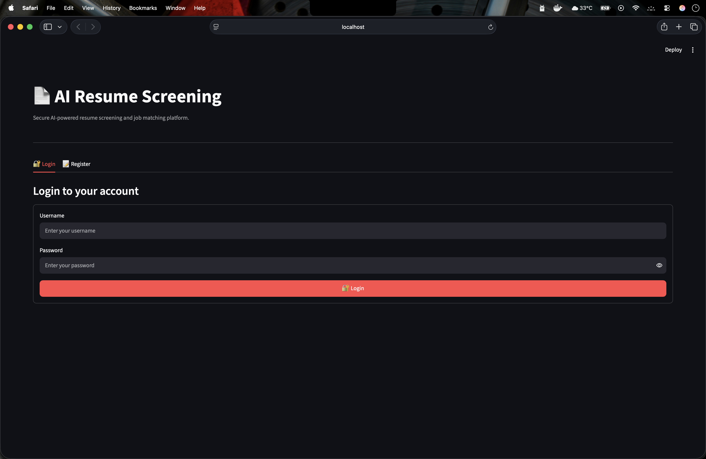
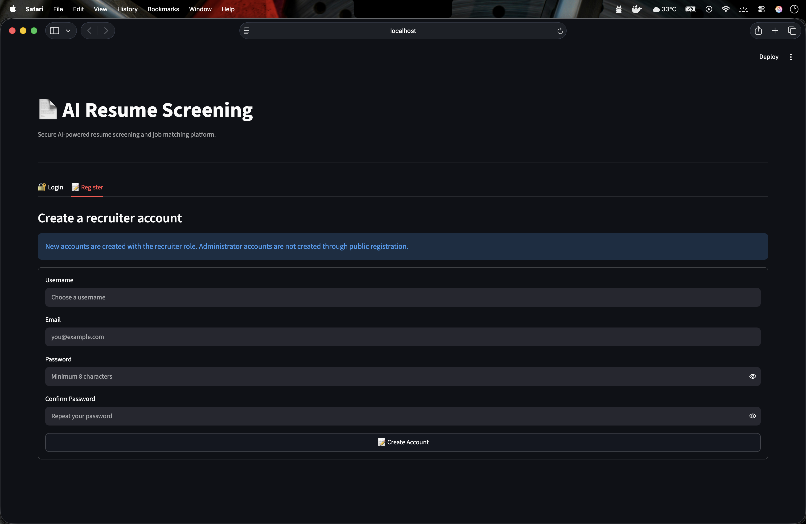
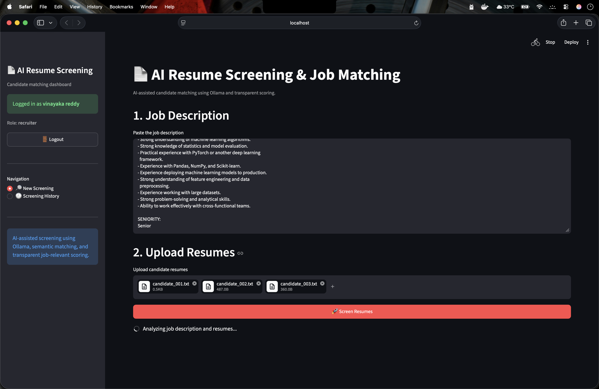
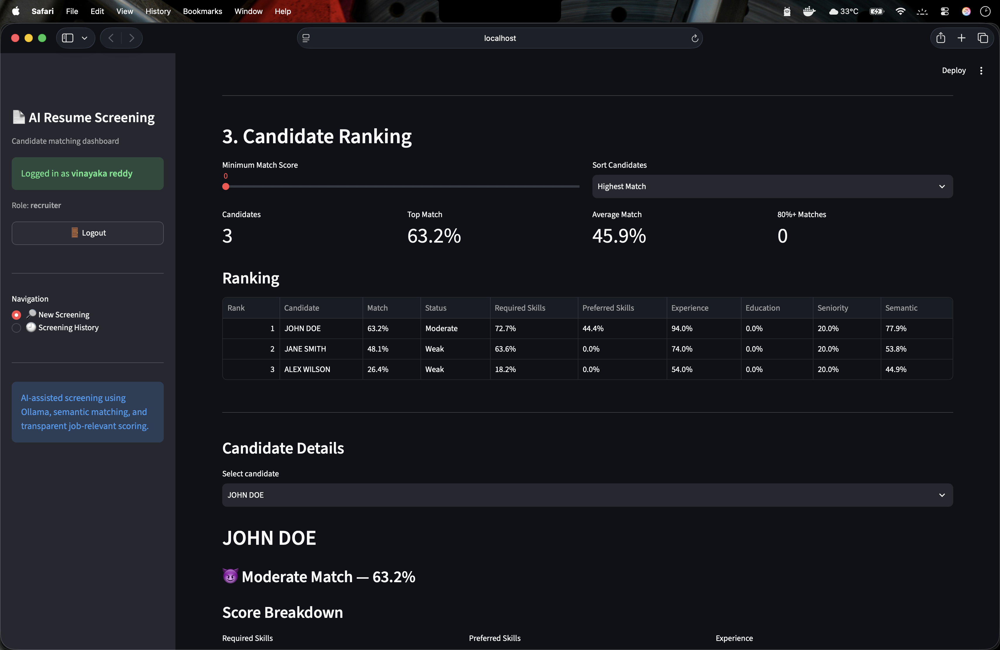
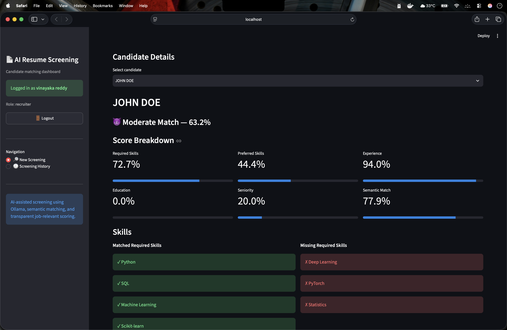
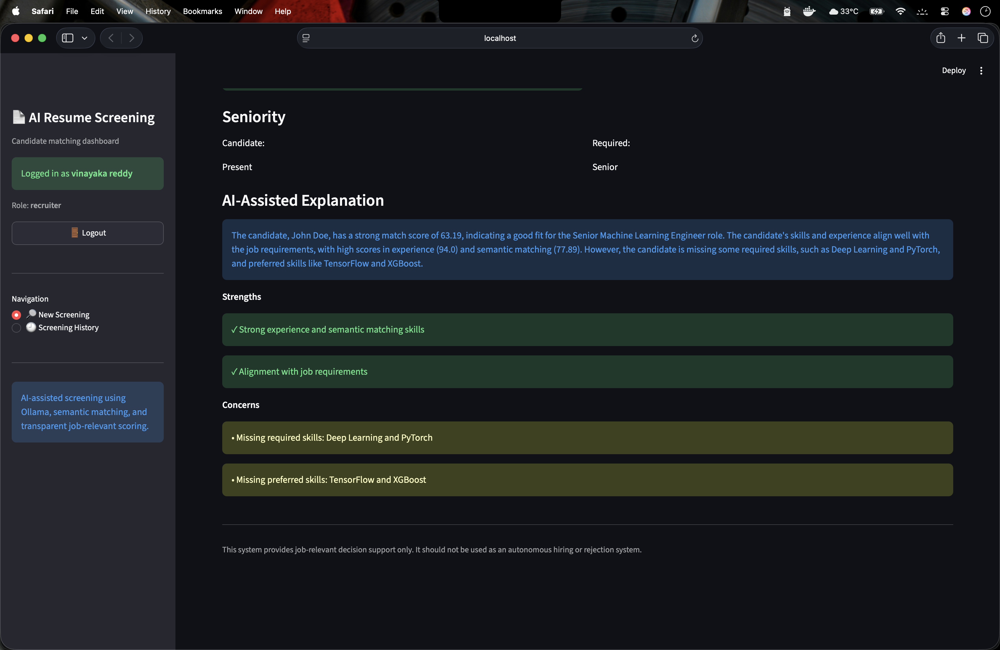
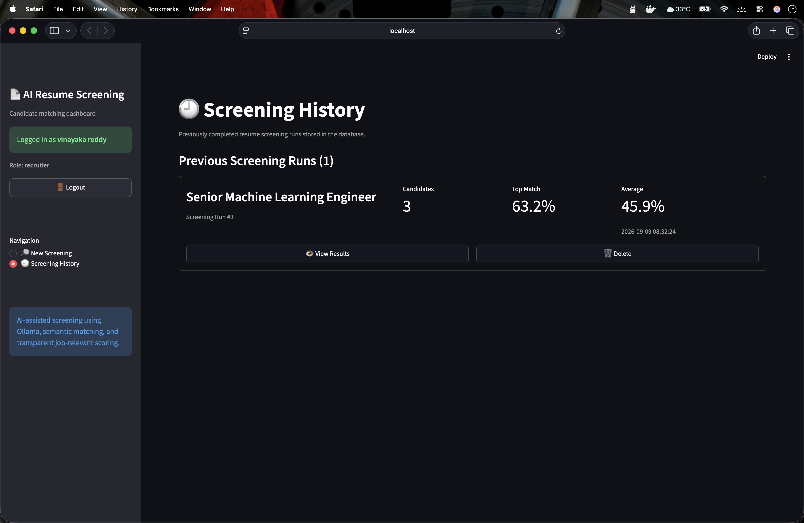
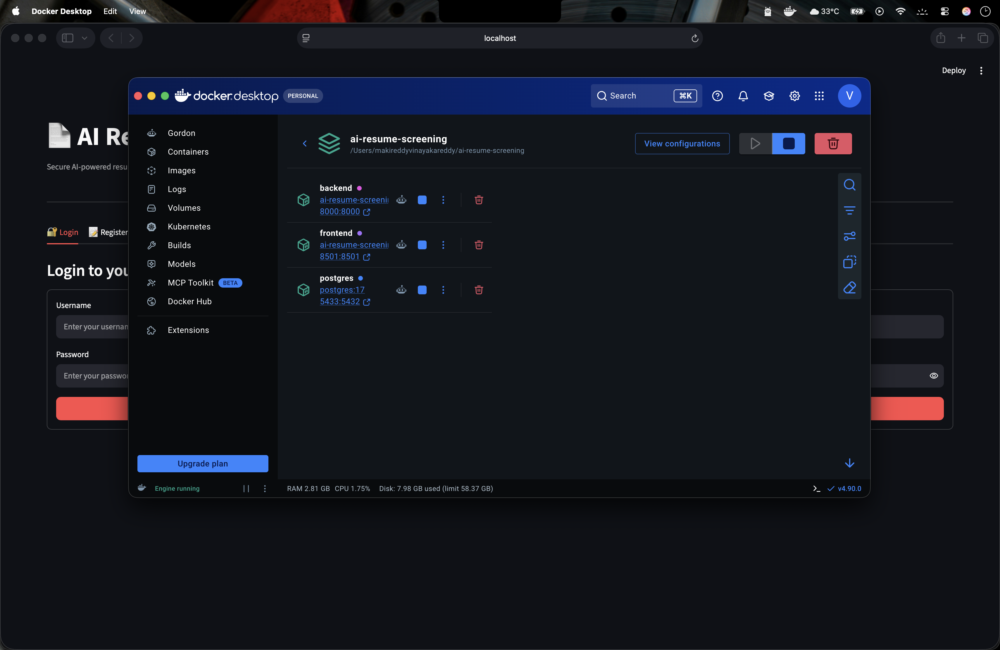

# Hi, I'm MAKIREDDYVINAYAKAREDDY 👋

## AI / Machine Learning Developer

I'm passionate about building practical AI and Machine Learning applications using Python, NLP, Deep Learning, Generative AI, and modern backend technologies.

### 🚀 Featured Project

#### 🤖 AI Resume Screening & Job Matching

An AI-powered recruitment screening system that:

- Parses PDF and DOCX resumes
- Extracts candidate skills
- Analyzes job descriptions
- Performs deterministic skill matching
- Uses semantic embeddings for similarity matching
- Generates candidate-job match scores
- Uses Llama 3.2 through Ollama for AI-generated explanations
- Stores screening history in PostgreSQL
- Provides JWT authentication and RBAC
- Exposes REST APIs through FastAPI
- Uses Streamlit for the frontend
- Runs with Docker Compose

🔗 [View Project](https://github.com/MAKIREDDYVINAYAKAREDDY/ai-resume-screening)

---

## 🧠 Technical Skills

### Programming
- Python
- SQL

### Machine Learning
- Scikit-learn
- Feature Engineering
- Model Evaluation
- Classification
- Regression
- Ensemble Learning
- Anomaly Detection

### Deep Learning
- Neural Networks
- CNNs
- RNNs
- LSTMs
- GRUs
- Transformers

### NLP & Generative AI
- Natural Language Processing
- Text Embeddings
- Semantic Search
- Large Language Models
- Prompt Engineering
- Retrieval-Augmented Generation
- Ollama
- Llama

### Computer Vision
- Image Classification
- Object Detection
- Image Segmentation
- Vision Transformers

### MLOps / Backend
- FastAPI
- REST APIs
- Docker
- Docker Compose
- PostgreSQL
- SQLAlchemy
- Alembic
- Git
- GitHub

---

## 🔥 What I'm Building

I'm currently focused on developing end-to-end AI applications that combine:

```text
Machine Learning
      +
Deep Learning
      +
NLP
      +
Generative AI
      +
FastAPI
      +
PostgreSQL
      +
Docker
## 📸 Screenshots

### 🔐 Authentication

#### Login


#### Registration


---

### 📊 Application

#### Dashboard


#### Resume Screening


#### Candidate Details


#### AI Explanation


#### Screening History


---

### 🐳 Docker Deployment

#### Docker Environment

